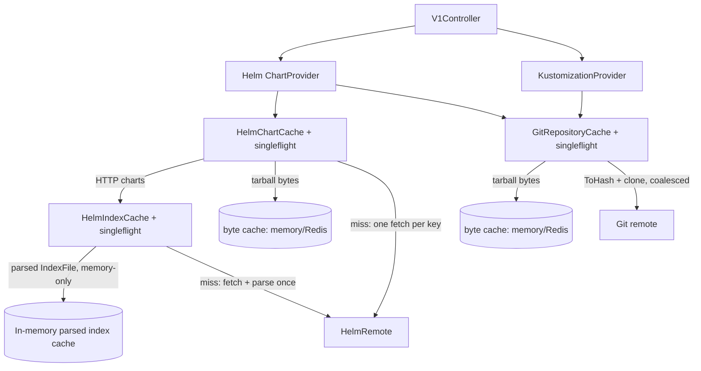

# Requirements

### Overview & Goals
Improve the performance and efficiency of manifest-maestro's caching layer (`internal/service/cache`). Analysis identified three concrete hot spots:

1. **Repeated index parsing** — `HelmIndexCache.RetrieveIndex` re-parses, re-validates, and re-sorts the raw index YAML/JSON (often tens of MB for large repositories like Bitnami) on **every request**, even on cache hits.
2. **No request coalescing** — concurrent cache misses for the same key (git repository tarball, Helm index, Helm chart) each trigger their own remote fetch, causing redundant network traffic and load spikes.
3. **Hardcoded cache TTLs** — retention times are baked into the code (`5*time.Minute` for OCI charts, `15*time.Minute` for HTTP charts, indexes, and git repos) and cannot be tuned per deployment.

### Scope
**In scope:**
- Cache parsed `*repo.IndexFile` objects in memory instead of raw index bytes (parse once per index version per instance).
- Per-cache `singleflight` request coalescing in `GitRepositoryCache`, `HelmIndexCache`, and `HelmChartCache` (including coalescing of concurrent `git.ToHash` ref resolutions).
- Environment-variable-configurable TTLs for all caches, with current values as defaults.
- Tests covering the new behavior (coalescing, parse-once, TTL config parsing).
- README documentation for the new environment variables.

**Out of scope (per user decision):**
- Any change to API response bodies or HTTP status codes (current contract is kept exactly).
- Implementing the `list-charts` / `list-chart-versions` stub endpoints or fixing their routing.
- Error-handling refactoring (typed errors, status-code refinement).
- Caching of git ref→hash resolution (branch/tag freshness is preserved; every request still resolves, only *concurrent identical* resolutions are coalesced).

### Functional Requirements
- **FR1**: A Helm repository index is parsed at most once per index content per instance; subsequent requests within the TTL reuse the parsed `*repo.IndexFile`.
- **FR2**: N concurrent requests that miss the cache for the same git repository / Helm index / Helm chart result in exactly one remote fetch; all callers receive the same result (or the same error).
- **FR3**: Cache TTLs are configurable via environment variables:
  - `CACHE_GIT_REPOSITORY_TTL` (default `15m`)
  - `CACHE_HELM_INDEX_TTL` (default `15m`)
  - `CACHE_HELM_CHART_HTTP_TTL` (default `15m`)
  - `CACHE_HELM_CHART_OCI_TTL` (default `5m`)
- **FR4**: All existing API behavior, response shapes, and status codes remain unchanged.

### Non-Functional Requirements
- No new heavyweight dependencies — `golang.org/x/sync` (singleflight) is already in `go.mod`.
- Behavior with `SYNCHRONIZATION_METHOD=REDIS` remains functional: git repo and chart tarball caches stay Redis-shareable; only the Helm index cache becomes per-instance in-memory (accepted trade-off for eliminating repeated multi-MB parses).

# Technical Design

### Current Implementation
- `internal/service/cache/helmindexcache.go` — stores raw index bytes in `aucache.Cache[[]byte]` (memory or Redis, chosen in `internal/wiring/application.go#createByteSliceCache`), then calls `parseIndex` on **every** retrieval (cache hit or miss). `parseIndex` unmarshals, validates every entry, and sorts.
- `internal/service/cache/gitrepositorycache.go` — resolves ref→hash remotely (`git.ToHash`), then get-miss-fetch-set of a tar.gz of the repo worktree. TTL hardcoded to `15*time.Minute`.
- `internal/service/cache/helmchartcache.go` — HTTP path goes through the index cache, then get-miss-fetch-set of the chart tarball (TTL `15m`); OCI path fetches directly (TTL `5m`).
- `internal/config/application.go` — env-driven config via `caarlos0/env` with custom parser funcs; no cache-related settings.
- `internal/wiring/application.go` — constructs the three caches, each with its own byte-slice cache instance.
- Tests exist in `internal/service/cache/*_test.go` using generic mocks from `test/mock/cachemock`, `test/mock/gitmock`, `test/mock/helmremotemock`.

### Key Decisions (validated with user)
1. **Parsed-only index cache** — `HelmIndexCache` stores parsed `repo.IndexFile` values in a memory-only cache and drops the raw-bytes layer entirely. Rationale: eliminates all repeated parsing; index data is cheap to re-fetch per instance and freshness semantics are unchanged.
2. **Per-cache singleflight** — each cache service embeds its own `singleflight.Group` fields and wraps its fetch paths; no shared abstraction. Rationale: simple, localized, no new interfaces.
3. **No git ref→hash caching** — branch/tag freshness guaranteed; only concurrent identical `ToHash` calls are coalesced.
4. **TTLs via env config** — parsed natively as `time.Duration` by `caarlos0/env`, passed into cache constructors.

### Proposed Changes

**1. `internal/service/cache/helmindexcache.go`**
- Change the cache field to `cache aucache.Cache[repo.IndexFile]` and add a `ttl time.Duration` field:
```go
func NewHelmIndexCache(helmRemote HelmIndexRemote, cache aucache.Cache[repo.IndexFile], ttl time.Duration) *HelmIndexCache
```
- `RetrieveIndex` flow: normalize URL → `cache.Get` → on hit return `cached` (pointer to stored value) → on miss, coalesce via `sf.Do(cacheKey, ...)`: `helmRemote.GetIndex` → `parseIndex` → `cache.Set(key, *index, ttl)` → return.
- Returned `*repo.IndexFile` is documented as read-only (its only consumer, `HelmChartCache`, calls the non-mutating `index.Get`).

**2. `internal/service/cache/gitrepositorycache.go`**
- Add `sfResolve singleflight.Group` (key `repoURL|gitReference`) around `git.ToHash`.
- Add `sfFetch singleflight.Group` (key `repoURL|commitHash`, the existing `cacheKey`) around the miss path (`refreshRepository`).
- Constructor gains `ttl time.Duration`; replaces hardcoded `15*time.Minute`.

**3. `internal/service/cache/helmchartcache.go`**
- Add `sf singleflight.Group` keyed by the existing `cacheKey` around the get-miss-fetch-set flow in both `retrieveHelmChartViaHTTP` and `retrieveHelmChartViaOCI` (shared helper method `retrieveCoalesced(ctx, cacheKey, ttl, fetch func() ([]byte, error))`).
- Constructor gains `httpTTL, ociTTL time.Duration`; replaces hardcoded values.

**4. `internal/config/application.go`**
- Add fields to `ApplicationConfig`:
```go
CacheGitRepositoryTTL time.Duration `env:"CACHE_GIT_REPOSITORY_TTL" envDefault:"15m"`
CacheHelmIndexTTL     time.Duration `env:"CACHE_HELM_INDEX_TTL"     envDefault:"15m"`
CacheHelmChartHTTPTTL time.Duration `env:"CACHE_HELM_CHART_HTTP_TTL" envDefault:"15m"`
CacheHelmChartOCITTL  time.Duration `env:"CACHE_HELM_CHART_OCI_TTL"  envDefault:"5m"`
```

**5. `internal/wiring/application.go`**
- `createHelmIndexCache`: build `aucache.NewMemoryCache[repo.IndexFile]()` (no longer via `createByteSliceCache` — index cache is always in-memory now) and pass `CacheHelmIndexTTL`.
- `createGitRepositoryCache` / `createHelmChartCache`: pass configured TTLs.

**6. `README.md`** — document the four new environment variables in the Configuration section and note that the Helm index cache is per-instance in-memory.

### Architecture Diagram


### Risks
- **Singleflight context semantics**: `sf.Do` executes the fetch under the *first* caller's context; if that request is canceled, all coalesced callers fail. Acceptable for short fetches; the fetch closure will use the initiating caller's context (documented in code).
- **Shared results**: coalesced callers receive the same `[]byte` / `*repo.IndexFile`; all consumers treat these as read-only (already true today for cached values returned from Redis/memory caches).
- **Index no longer Redis-shared**: with `SYNCHRONIZATION_METHOD=REDIS`, each instance fetches indexes independently. Accepted trade-off; TTL keeps traffic bounded.
- **`aucache` memory cache with struct values**: `cachemock` and `aucache.NewMemoryCache` are generic; storing `repo.IndexFile` values is supported. Verified `cachemock.New[T]` is fully generic.

# Testing

### Validation Approach
All validation is automated via `go test ./...` using the existing generic mocks in `test/mock/` (extended with invocation counters where needed). `go build ./...` and `go vet ./...` must stay clean. No API-contract changes means existing tests must pass unmodified except for constructor-signature updates.

### Key Scenarios
- **Parse-once index caching** (`helmindexcache_test.go`):
  - Cache miss → remote `GetIndex` called once, parsed index stored, correct entries returned.
  - Second retrieve → remote **not** called again; same parsed content returned (assert via call counter on `helmremotemock`).
  - Invalid/empty/no-APIVersion index data still returns the same errors as today.
- **Request coalescing** (all three cache test files):
  - Spawn ~20 goroutines calling the same retrieve concurrently against a mock remote that counts invocations (and optionally blocks on a channel to guarantee overlap) → exactly 1 remote call; all goroutines get identical results.
  - Different keys retrieved concurrently → one remote call **per key** (no over-coalescing).
  - Remote error during coalesced fetch → all callers receive the error; a subsequent call retries (singleflight does not cache errors).
  - `GitRepositoryCache`: concurrent `ToHash` resolutions for the same `repoURL|ref` coalesce to one `RemoteReferences` call; cached-tarball hits still call `ToHash` every time (freshness preserved).
- **TTL configuration** (new `internal/config/application_test.go` cases):
  - Defaults applied when env vars unset (`15m`/`15m`/`15m`/`5m`).
  - Custom values (e.g. `CACHE_HELM_INDEX_TTL=1h`) parsed correctly; invalid values produce a parse error.
  - Cache services pass the configured TTL to `cache.Set` (assert via a TTL-recording cache mock).

### Edge Cases
- Concurrent retrieves where the first caller's context is canceled mid-fetch — verify no panic and callers receive an error.
- OCI vs HTTP chart paths use their respective TTLs.
- Parsed index cache returns a pointer — verify repeated retrieves are consistent after `HelmChartCache` performs lookups.

### Test Changes
- Update existing cache tests for new constructor signatures (`NewHelmIndexCache`, `NewGitRepositoryCache`, `NewHelmChartCache`).
- Extend `test/mock/helmremotemock` and `test/mock/gitmock` with thread-safe call counters (and an optional fetch-blocking hook for concurrency tests).
- Add TTL-capturing capability to `test/mock/cachemock` (record the `time.Duration` passed to `Set`).

# Delivery Steps

###   Step 1: Make cache TTLs configurable via environment
All three caches use TTLs from `ApplicationConfig` instead of hardcoded constants, with current values as defaults.

- Add `CacheGitRepositoryTTL`, `CacheHelmIndexTTL`, `CacheHelmChartHTTPTTL`, `CacheHelmChartOCITTL` (`time.Duration`, env-tagged with defaults `15m`/`15m`/`15m`/`5m`) to `internal/config/application.go`.
- Extend the constructors `NewGitRepositoryCache` and `NewHelmChartCache` with TTL parameters and replace the hardcoded `5*time.Minute` / `15*time.Minute` in `gitrepositorycache.go` and `helmchartcache.go` (the index cache TTL is wired in the next stage).
- Pass the configured TTLs in `internal/wiring/application.go` (`createGitRepositoryCache`, `createHelmChartCache`).
- Add config parsing tests (defaults, custom values, invalid values) in a new `internal/config/application_test.go`; extend `test/mock/cachemock` to record the TTL passed to `Set` and assert it in cache tests.
- Document the new environment variables in `README.md`.

###   Step 2: Cache parsed Helm index objects instead of raw bytes
`HelmIndexCache` stores parsed `repo.IndexFile` values in a memory-only cache, so each index version is parsed at most once per instance.

- Rework `internal/service/cache/helmindexcache.go`: change the cache field to `aucache.Cache[repo.IndexFile]`, add a `ttl` field, and update `RetrieveIndex` to return cached parsed indexes directly (no re-parse on hit); on miss fetch via `helmRemote.GetIndex`, parse once with the existing `parseIndex`, store, and return.
- Update `NewHelmIndexCache(helmRemote, cache, ttl)` signature; document the returned `*repo.IndexFile` as read-only.
- Update `internal/wiring/application.go#createHelmIndexCache` to always build `aucache.NewMemoryCache[repo.IndexFile]()` (dropping the `createByteSliceCache` usage for indexes) and pass `CacheHelmIndexTTL`.
- Update `internal/service/cache/helmindexcache_test.go`: use `cachemock.New[repo.IndexFile]()`, add a call counter to `test/mock/helmremotemock`, and assert the remote is hit exactly once across repeated retrieves while parse-error cases keep returning the same errors as today.

###   Step 3: Add singleflight request coalescing to all three caches
Concurrent cache misses for the same key trigger exactly one remote fetch per cache; all callers share the result.

- `internal/service/cache/gitrepositorycache.go`: add `sfResolve singleflight.Group` around `git.ToHash` (key `repoURL|gitReference`) and `sfFetch singleflight.Group` around the miss path in `refreshRepository` (key = existing `cacheKey`).
- `internal/service/cache/helmindexcache.go`: add `sf singleflight.Group` around the fetch-parse-store miss path keyed by the normalized repository URL.
- `internal/service/cache/helmchartcache.go`: add `sf singleflight.Group` and a shared `retrieveCoalesced` helper wrapping the get-miss-fetch-set flow of both `retrieveHelmChartViaHTTP` and `retrieveHelmChartViaOCI` (key = existing `cacheKey`).
- Use `golang.org/x/sync/singleflight` (already in `go.mod`); document the first-caller-context semantics in code comments.
- Add concurrency tests in all three cache test files: N concurrent identical retrieves → 1 remote call (mock remotes gain thread-safe call counters and an optional blocking hook in `test/mock/gitmock` / `test/mock/helmremotemock`); distinct keys are not over-coalesced; fetch errors propagate to all callers and are retried on the next call.
- Final validation: `go build ./...`, `go vet ./...`, and `go test ./... -race -count=1` all pass.